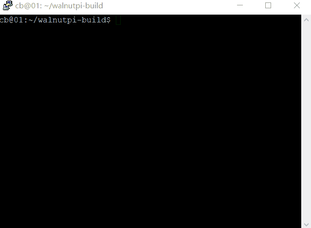
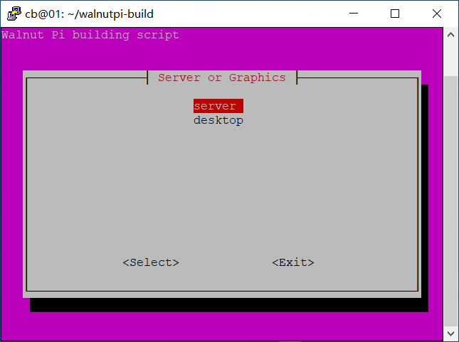

walnutpi-build
======
为核桃派编译系统镜像
- 需要在ubuntu22.04上运行
- toolchain会在运行时从清华源下载
- 各种软件也是当场apt安装最新版
- 运行时要全程联网，确保能连接github


1.clone
------
```
git clone -b main --depth 1 https://github.com/walnutpi/walnutpi-build.git
```
2.run
------
```
sudo ./build.sh
```
在命令行出来的界面里，按`Esc`退出，`上下方向键`选择,按`回车`确认


第一个页面是选择板子，按回车确认，目前支持
- walnutpi-1b

------

- image: 自动构建完整镜像。生成一个`IMG_xxx.img镜像`文件输出到output目录
- U-boot bin: 仅编译ubuntu项目，将编译结果输出到output目录
- Kernel bin: 仅编译linux项目，将编译结果输出到output目录
- Rootfs tar: 仅构建一个可用的rootfs，装好所需软件，驱动，各种配置，压缩成一个`rootfs_xxx.tar`输出到output目录

------

- server: 无桌面，启动快，基本功能都可以玩。
- desktop: 在server版本基础上安装了xfce4桌面，预装了用于编程办公的桌面应用，玩法更多。


